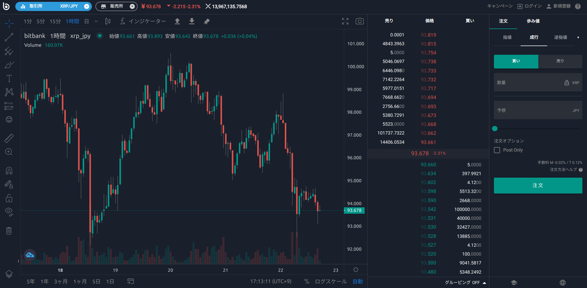

## DEFITの特徴を解説

DEFITはプロのインストラクターと共に、健康でアクティブなライフスタイルを確立するのを目指すために立ち上げられたプロジェクトです。  
従来はプロのインストラクターだけが報酬を受け取っていましたが、DEFITトークンを利用することでユーザーが運動しながら稼げるようになります。  

DEFITトークンは2021年4月7日にEthereumとPolygonネットワーク上で発行されました。  

### 運動しながら稼ぐ

STEPNで話題となったMove To Earn、つまり運動しながら稼ぐをDEFITも実現させます。  
他のMove To Earnプロジェクトと違う点は、ユーザーがプロの指導を受けながら運動して稼げることです。  
従来であればインストラクター側しか稼ぐことが出来ませんでしたが、ユーザーが健康になるためのインセンティブとしてDEFITが一部還元されます。  

### DEFITトークンの使い道

DEFITトークンは他の仮想通貨と同じく取引所でトレードすることができます。その他にDEFITトークンならではの使い道が主に2つあります。  
1つ目は、プロのインストラクターが提供しているサービスの支払いに使えます。  
2つ目は、DEFITトークンの保有量に応じてパートナーブランドの商品購入時に割引を受けることができます。

## DEFITの購入方法

2022年4月時点でDEFITは国内取引所に上場していないので、海外取引所であるMEXC Globalで購入します。  
MEXC GlobalでDEFITを購入するまでの方法をご紹介します。

### 1.bitbankで口座開設

国内取引所の口座をお持ちでない方は、bitbankで口座開設をしましょう。  
[bitbank公式ページ](https://bitbank.cc/)にアクセスして口座開設ボタンをクリックして登録作業を行って下さい。

### 2.リップル(XRP)を購入

口座開設完了したら、日本円を入金しましょう。  
日本円は銀行から振り込むことができます。  
入金が反映されたらリップル(XRP)を取引所で購入します。
メジャーなBitcoinではなくXRPを購入する理由は、XRPの方が送金手数料が安いからです。  

bitbankでは取引所の他に販売所でもXRPを購入できますが、スプレッドが広く購入した時点で損失が出てしまいます。**必ず取引所で購入しましょう！**  

### 3.XRPをMEXC Globalへ送金

bitbankで購入したXRPをMEXC Globalへ送金しましょう。  
bitbankで送金先アドレスに、MEXC GlobalのXRPのウォレットアドレスをコピペします。  
ウォレットアドレスは長く、間違えると大変なことになるので手入力は避けて下さい。  
送金依頼が完了してしばらく待てばMEXC Globalへ入金されます。

### 4.XRP->USDT->DEFITにトレード

MEXC GlobalではDEFIT/USDTの取引ペアしかありません。つまり、XRPを元手にDEFITに購入することはできません。  
なので一旦XRPをUSDTにしてからDEFITを購入しましょう。  
DEFITの購入は[MEXC Globalの取引所](https://www.mexc.com/exchange/DEFIT_USDT)からできます。

## DEFITの稼ぎ方

DEFITを稼ぐ方法はユーザーか、インストラクターとしてかの2通りあります。

### ユーザーとして稼ぐ

|||
|:--:|:--|
|リファラル|招待コード経由でアプリがダウンロードされると10トークン獲得できます。10回の招待が上限なので、最大で100トークン貰えます。|
|チャレンジ達成|公開されるチャレンジを達成すると報酬が貰えます。2022年4月22日時点では具体的なチャレンジ内容や報酬額はまだ発表されていません。|
|プロモーション|プロモーションのイベントやチャレンジに参加すると報酬が貰えます。|
|ロイヤリティ|DEFITトークンを保有しているとDEFITやビットコインなどがエアドロされます。また、DEGITトークンの保有量に応じて、パートナーブランドのスポーツアパレルやアクセサリーの割引が適用されます。|

### インストラクターとして稼ぐ

|||
|:--:|:--|
|登録|インストラクターとして登録して、360Wellnessチームから承認されるとトークンが貰えます。|
|ユーザーからの報酬|ユーザーに対してコーチングしながら稼ぐことができます。レッスンを公開する時にDEFITで支払いを受け付けれます。注意点として2つ以上の支払い方法を提供する必要があるので、DEFITで支払われるかはユーザー次第です。|

## DEFITに関するFAQ

### 公式アプリのリリースはいつ？

公式のツイートでは5月にリリース予定です。  

DEFITが統合されていないアプリは既にリリース済みです。  
アプリをインストールして試してみては？  
[Apple Store](https://apps.apple.com/us/app/360wellness/id1511566195) | [Google Play Store](https://play.google.com/store/apps/details?id=com.app360Sports.wellness.prod&hl=fr&gl=US)



### NFTは発売されるの？

ホワイトペーパーにはNFTを発売する予定である旨が記載されています。  
NFTはDEFITで活動すればするほど進化していきます。マイルストーンが完了すると、ヨガ・筋トレ・サイクリングなど自身のライフスタイルに応じて新しい属性がNFTに付与されます。  
NFTを保有していると、報酬を受けたり、利益を獲得することができます。  

2022年4月時点では抽象的な説明しかないので、具体的なNFTのユーティリティが発表されるのを待ちましょう。

## Reference

- [DEFIT公式ページ](https://defit.io/)
- [ホワイトペーパー](https://f.hubspotusercontent10.net/hubfs/8386260/DEFIT%20Litepaper%202.0.pdf)

