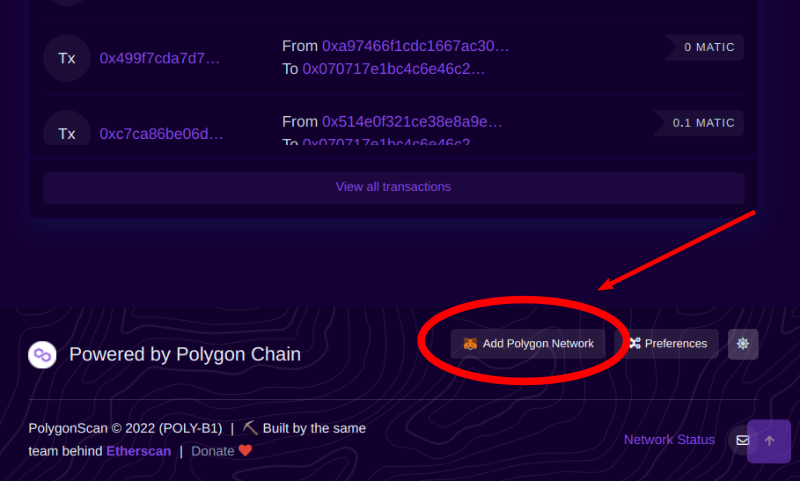

MEXC GlobalとQuickswapでの2通りの購入方法をご紹介します。初心者🔰の方は比較的簡単なMEXC Glonalでの購入をおすすめします。

## DEFITとは？

DEFITはプロのインストラクターと共に、健康でアクティブなライフスタイルを確立するのを目指すために立ち上げられたプロジェクトです。  
従来はプロのインストラクターだけが報酬を受け取っていましたが、DEFITトークンを利用することでユーザーが運動しながら稼げるようになります。  

さらにDEFITの特徴や稼ぎ方を知りたい方は[話題となっているMove To EarnプロジェクトのDEFITを解説]()を読んでみて下さい。

## どこで購入できるの？

DEFITの購入場所は多く分類するとCEX(中央集権型取引所)とDEX(分散型取引所)の2つあります。  
2022年4月時点でDEFITが上場済みのCEXは**MEXC Global**と**Probit Global**があります。DEXは**Quickswap**と**Uniswap**で購入できます。  
それぞれメリット・デメリットがあるので、自分に適している方法を選択して下さい。迷う場合は購入手順が簡単なCEX、つまりMEXC Globalでの購入をおすすめします。

## MEXC Global(海外取引所)で購入

### 1.bitbankで口座開設

国内取引所の口座をお持ちでない方は、bitbankで口座開設をしましょう。  
[bitbank公式ページ](https://bitbank.cc/)にアクセスして口座開設ボタンをクリックして登録作業を行って下さい。

### 2.リップル(XRP)を購入

口座開設完了したら、日本円を入金しましょう。  
日本円は銀行から振り込むことができます。  
入金が反映されたらリップル(XRP)を取引所で購入します。
メジャーなBitcoinではなくXRPを購入する理由は、XRPの方が送金手数料が安いからです。  

bitbankでは取引所の他に販売所でもXRPを購入できますが、スプレッドが広く購入した時点で損失が出てしまいます。**必ず取引所で購入しましょう！**  

### 3.XRPをMEXC Globalへ送金

bitbankで購入したXRPをMEXC Globalへ送金しましょう。  
bitbankで送金先アドレスに、MEXC GlobalのXRPのウォレットアドレスをコピペします。  
ウォレットアドレスは長く、間違えると大変なことになるので手入力は避けて下さい。  
送金依頼が完了してしばらく待てばMEXC Globalへ入金されます。

### 4.XRP->USDT->DEFITにトレード

MEXC GlobalではDEFIT/USDTの取引ペアしかありません。つまり、XRPを元手にDEFITに購入することはできません。  
なので一旦XRPをUSDTにしてからDEFITを購入しましょう。  
DEFITの購入は[MEXC Globalの取引所](https://www.mexc.com/exchange/DEFIT_USDT)からできます。

## Quickswap(DEX)で購入

手数料をできる限り安く抑えてDEFITを購入する方法を説明していきます。

### 1.Metamaskのインストール

Metamaskは仮想通貨(暗号資産)のウォレットです。  
世界で2100万ユーザーの方が使用しており、仮想通貨業界ではディファクトスタンダードのウォレットになります。  
Metamaskはアプリ(iOSとAndroid)とブラウザの拡張機能をリリースしていますので、お好みの方法でインストールして下さい。インストールは[こちら](https://metamask.io/download/)からできます。  

本記事ではブラウザの拡張機能を使用した方法で説明していきます。

### 2.MetamaskにPolygon Networkを追加

手数料を安く抑えるためにPolygon Networkを使用します。Metamaskの初期設定ではEthereum Networkしかないので、追加で設定してあげましょう。  
設定方法は自動と手動の2つあります。

#### 自動設定

1. [polygonscanサイト](https://polygonscan.com/)にアクセス
2. ページ下部の**Add Polygon Network**ボタンをクリック

3. Metamaskが起動するので**Add Polygon Network**ボタンをクリック
4. **Aprove**ボタンをクリック

#### 手動設定

1. Metamaskの**ネットワーク追加**ボタンをクリック

2. 下記のPolygon Network情報を入力
|フィールド名|値|
|:--:|:--:|
|Network Name|Polygon Mainnet|
|New RPC URL|https://polygon-rpc.com/|
|Chain ID|137|
|Currency Symbol|MATIC|
|Block Explorer URL|https://polygonscan.com/|
3. **保存**ボタンをクリック

入力に間違いがないか複数回確認してからネットワークの保存をして下さい。内容が間違っていると入出金できませんので注意しましょう！

### 3.MetamaskにDEFITトークンを追加

MetamaskのデフォルトのトークンリストにDEFITは含まれていないので追加しましょう。

1. [polygonscanのDEFITページ](https://polygonscan.com/token/0x428360b02c1269bc1c79fbc399ad31d58c1e8fda)にアクセス
2. **Add Token to Web3 Wallet**ボタンをクリック

3. Metamaskが起動するのでトークンを追加

4. DEFITが一覧に表示されたら完了

### 4.JPYCを購入

JPYCは日本円ステーブルコインです。Ethereum Network上で動いています。Ethereum以外にも、Polygon・Shiden・Gnosis・Avalancheのチェーンをサポートしています。  
今回はPolygon Network上のJPYCを購入します。  
購入は[こちら](https://app.jpyc.jp/)からできます。

#### Metamaskを接続

**ウォレットを接続**ボタンをクリックしてMetamaskを接続します。

#### JPYCトークンをMetamaskに追加
   
1. **JPYC**ボタンをクリック

2. Metamaskのアイコンをクリックすると、Metamaskが起動するのでトークンを追加しましょう。

#### フォーム入力

1. JPYCの購入金額を入力  
最低購入金額は10,000JPYC(1JPYC=1円なので１万円)
1. ネットワークは**Polygon**を選択します
2. 送信先アドレスを入力  
Metamaskを接続すると自動入力されるので、正しいアドレスかどうか再度確認しましょう
1. 個人情報の入力
2. **支払いを進む**ボタンをクリック  
JPYCの購入申し込みは完了です
6. 銀行振込  
JPYC側で処理が完了して入金されると、Metamask上でJPYCの資産が増えているはずです

### 5.QuickswapでJPYCをDEFITにスワップ

1. Metamaskを接続
2. FromフィールドでJPYCを選択

3. ToフィールドでDEFITを検索  
デフォルトでは検索しても出てこないので、コントラクトアドレス **0x428360b02C1269bc1c79fbC399ad31d58C1E8fdA**を入力  
DEFITが検索結果として表示されるので選択

4. 金額を入力してスワップ

これでJPYCからDEFITへのスワップが完了しました。  
MetamaskのDEFIT残高が増えているはずです！

## まとめ

### MEXC GlobalでDEFITを購入する方法

1. 国内取引所で口座開設
2. 日本円を入金してXRPを購入
3. MEXC Globalの口座へXRPを送金
4. MEXC GlobalでXRP→USDT→DEFITにトレード

### QuickswapでDEFITを購入する方法

1. Metamaskをインストール
2. Metamaskで初期設定をする
3. JPYCを購入
4. QuickswapでJPYCからDEFITへスワップ

## Reference

- https://docs.polygon.technology/docs/develop/metamask/config-polygon-on-metamask/
- https://polygonscan.com/token/0x428360b02c1269bc1c79fbc399ad31d58c1e8fda
- https://jpyc.jp/
- https://blog.jpyc.jp/how_to_use_polygon
- https://blog.jpyc.jp/how-to-buy-jpyc-more

